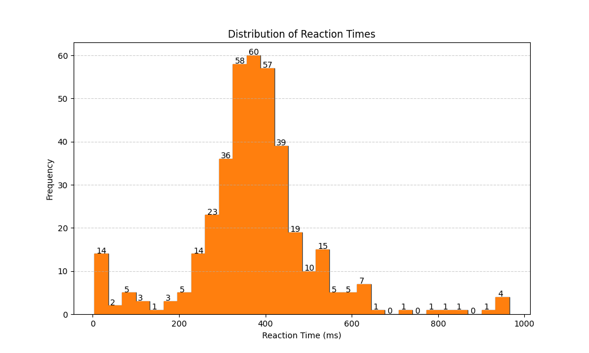

## Reaction Test
A simple Flask application to measure your reflexes and compare them against a Gaussian population distribution. 
Designed to collect data for my Specialist Math SAC while letting users have a bit of fun.

### Participate in survey
Thank you to the **52 participants** who took part in the survey. 
Unfortunately, data from the last seven users was lost. But I still greatly appreciate everyone who contributed.

~~Click here: [here]()!~~

As promised, the raw data is available here: <br>
Last updated from the website on 7/9/2025. <br>
[`/dataset`](./dataset/reaction.sql)

The dataset also provides a neat demonstration of the Central Limit Theorem:


### Possible systematic error:
```css
transition: background-color 0.3s, transform 0.2s;
```
This transform-transition for the background of 300ms may have shifted the user results. But the exact amount cannot be quantified. This line (49) has been **commented out now**.


## Features
- Personal reaction time distribution with <b>mean, standard deviation, and trial count</b>
- Comparison to the <b>global population distribution</b>
- Percentile ranking against the global distribution

## Installation
```py 
pip install -r requirements.txt
```

## Usage
```bash
python app.py
```
Then open http://127.0.0.1:8000 in your browser
